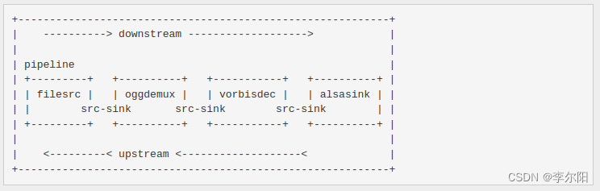
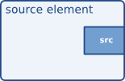
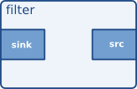
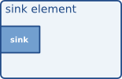

# 6 Events: Seeking, Navigation and More

有许多不同类型的事件，但它们只有两种传递方式：向下游或向上游。非常重要的是要了解这两种方法的工作原理，因为如果管道中的一个元素没有正确处理它们，整个管道的事件系统将会失效。我们将在这里尝试解释这些方法是如何工作的，以及元素应该如何实现它们。







- **上游元素（Upstream Elements）**：上游元素通常是管道中数据生成或输入的起点，它们负责生成或提供多媒体数据流，如音频、视频或其他数据。
上游元素通常是源（Source）元素，例如从文件、网络、摄像头或麦克风等获取数据的元素。

- **下游元素（Downstream Elements）**：下游元素通常是管道中数据处理或输出的终点。它们负责处理、呈现或传输多媒体数据流。下游元素通常是转码器、渲染器、显示器、存储器或网络输出元素。

- **上游事件（Upstream Events）**：上游事件是从下游元素传递到上游元素的事件。下游元素sink pad传到上游元素src pad。

  通常，这些事件用于向上游元素发送信息、请求或控制命令，以影响数据流的生成或传递。

  例如，一个下游元素可以发送一个上游事件，请求上游元素切换到不同的视频分辨率，或者请求上游元素更改音频编解码器。上游元素可以根据这些事件来调整其行为。

- **下游事件（Downstream Events）**：下游事件是从上游元素传递到下游元素的事件。上游元素src pad传到下游元素sink pad。

  通常，这些事件用于向下游元素发送信息、请求或控制命令，以影响数据流的处理或呈现。

  例如，一个上游元素可以发送一个下游事件，通知下游元素暂停、恢复、改变播放速度等。下游元素可以根据这些事件来执行相应的操作。


## 1 Downstream events

下游事件通过sink pad的事件处理程序接收，该处理程序在创建pad时使用 gst_pad_set_event_function() 进行设置。

下游事件可以以两种方式传递：它们可以是in-band（与缓冲流一起序列化）或out-of-band（通过管道瞬间传输，可能不在处理缓冲的流线程中，超前于正在处理或在管道中排队的缓冲）。最常见的下游事件（SEGMENT、CAPS、TAG、EOS）都与缓冲流一起序列化。

以下是一个典型的事件处理函数：

```c
static gboolean
gst_my_filter_sink_event (GstPad  *pad, GstObject * parent, GstEvent * event)
{
  GstMyFilter *filter;
  gboolean ret;

  filter = GST_MY_FILTER (parent);
  ...

  switch (GST_EVENT_TYPE (event)) {
    case GST_EVENT_SEGMENT:
      /* maybe save and/or update the current segment (e.g. for output
       * clipping) or convert the event into one in a different format
       * (e.g. BYTES to TIME) or drop it and set a flag to send a segment
       * event in a different format later */
      ret = gst_pad_push_event (filter->src_pad, event);
      break;
    case GST_EVENT_EOS:
      /* end-of-stream, we should close down all stream leftovers here */
      gst_my_filter_stop_processing (filter);
      ret = gst_pad_push_event (filter->src_pad, event);
      break;
    case GST_EVENT_FLUSH_STOP:
      gst_my_filter_clear_temporary_buffers (filter);
      ret = gst_pad_push_event (filter->src_pad, event);
      break;
    default:
      ret = gst_pad_event_default (pad, parent, event);
      break;
  }

  ...
  return ret;
}
```

如果您的元素是基于链式（chain-based）的，几乎总是需要实现一个接收事件（sink event）函数，因为这是您收到有关数据段（segments）、媒体格式（caps）以及流结束的通知方式。

如果您的元素完全基于循环（loop-based），您可能需要或者不需要一个接收事件函数（sink event function）（因为元素正在驱动管道，它将提前知道流的长度，或者通过 gst_pad_pull_range() 的流返回值来获得通知）。在某些情况下，即使是基于循环的元素，也可能会从上游元素接收事件（events）（例如，在它们前面有一个 id3demux 或 apedemux 元素的音频解码器，或者从发送有关流的其他信息的源（source）接收自定义事件的复用器（demuxers）中，就像 DVD 源一样）。

这段文本描述了在 GStreamer 中，基于链式和基于循环的元素可能需要实现接收事件函数的情况，具体取决于元素的类型和用途。

## 2 Upstream events

上游事件是由管道中某个下游元素生成的（例如，视频显示元素可能生成导航事件，通知上游元素有关鼠标指针的当前位置）。这也可能在应用程序的请求下间接发生，例如，当应用程序在管道上执行寻址（seek）时，此寻址请求将传递给一个下游元素，然后该下游元素将生成上游寻址事件。

最常见的上游事件包括寻址事件（seek events）、服务质量（Quality-of-Service，QoS）和重新配置事件。

可以使用 `gst_pad_send_event`` 函数发送上游事件。此函数简单地调用该 pad 的默认事件处理程序。pad 的默认事件处理程序是 gst_pad_event_default，它基本上将事件发送给内部链接 pad 的对等端。因此，上游事件始终到达您元素的 src pad，并由默认事件处理程序处理，除非您覆盖该处理程序以自行处理它。有一些特定情况下需要这样做：

- 如果您的元素有多个 sink pad。在这种情况下，您将需要决定将事件发送到哪个 sink pad（如果不是全部）。

- 如果您需要在本地处理该事件。例如，您可能希望在将其发送上游之前转换导航事件，或者处理 QoS 事件。

在事件处理程序中的处理方式并不重要，但必须绝对遵守一些重要规则，因为一个出现问题的元素事件处理程序会破坏整个管道事件处理。以下是这些规则：

- 始终使用默认的 gst_pad_event_default 方法处理您不打算处理的事件。此方法将根据事件，转发事件或丢弃它。

- 如果您基于接收到的事件生成了新事件，不要忘记对您接收到的事件进行 gst_event_unref。

- 事件处理程序函数应该返回 TRUE 或 FALSE，指示事件是否已处理。除非您确切知道已处理了事件，否则不要在该处理程序中简单地返回 TRUE/FALSE。

- 请记住，事件处理程序可能是从与流处理线程不同的线程调用的，因此请确保在所有地方使用适当的锁定。

## 3 All Events Together

本章节列出了当前正在使用的所有已定义事件的清单，以及它们应该如何被使用和解释。您可以使用 GST_EVENT_TYPE 宏来检查特定事件的类型（或者如果需要调试目的的字符串，可以使用 GST_EVENT_TYPE_NAME）。

要获取有关事件以及如何在不同情况下正确使用它们的更全面信息，请参阅GStreamer的设计文档。本节仅提供了一般概述。

### 3.1 Stream Start

未编写

### 3.2 Caps

CAPS事件包含了接下来缓冲区的格式描述。有关谈判的更多信息，请参阅“[Caps negotiation](https://gstreamer.freedesktop.org/documentation/plugin-development/advanced/negotiation.html?gi-language=c)”。

### 3.3 Segment

段事件被发送到下游，用于宣布流中有效时间戳的范围以及如何将它们转换为运行时间和流时间。段事件必须在第一个数据缓冲之前以及在刷新之后始终被发送（请参阅上文）。

第一个段事件是由驱动管道的元素创建的，比如在推送模式push-mode下操作的源元素或以pull-mode拉模式操作的解复用器demuxer/解码器decoder。然后，这个段事件在管道中传播，并可能在传播过程中进行转换（例如，解码器decoder可能会接收到以字节为单位的段事件，然后根据平均比特率将其转换为基于时间单位的段事件）。

根据元素类型，事件可以简单地使用gst_pad_event_default()进行转发，或者应该被解析并发送一个修改后的事件。后一种情况适用于解复用器demuxer，它们通常具有基于字节到时间的转换概念。它们的输入通常是基于字节的，因此传入事件也将以字节单位（GST_FORMAT_BYTES）为单位具有偏移量。然而，下游元素期望以时间单位的段事件，以便可以用它们来与管道时钟同步。因此，解复用器demuxer和类似元素不应该将事件转发，而应该对其进行解析、释放并将段事件（以时间单位，GST_FORMAT_TIME）发送到下游。

段事件是使用gst_event_new_segment()函数创建的。有关其参数的详细信息，请参阅API参考和设计文档。

解析此事件的元素可以使用gst_event_parse_segment()来提取事件的详细信息。元素可能会发现GstSegment API在跟踪当前段（如果它们希望将其用于输出剪切等用途）时很有用。

### 3.4 Tag（metadata）

标签事件被发送到下游，用于指示从流数据中解析的标签。目前，这用于在从一种格式转码到另一种格式时保留标签。标签在“[标签（元数据和流信息）](https://gstreamer.freedesktop.org/documentation/plugin-development/advanced/tagging.html?gi-language=c)”中有详细讨论。大多数元素将通过调用gst_pad_event_default()简单地转发事件。

标签事件是使用函数gst_event_new_tag()创建的，但更常见的情况是，元素将向下游发送一个标签事件，然后由sink elements将其转换为总线上的消息。所有这些函数都需要一个已填充的标签列表作为参数，它们将拥有该标签列表。

解析此事件的元素可以使用函数gst_event_parse_tag()来获取事件包含的标签列表。

### 3.5 End of Stream（EOS）

结束流（EOS）事件是在元素发送的流结束时发送的。接收此事件的元素（来自上游，因此在其sink pad上接收该事件）通常会处理任何已缓冲的数据（如果有的话），然后将事件转发到下游。gst_pad_event_default()会处理所有这些，所以大多数元素不需要支持此事件。例外情况是明确需要在EOS时关闭资源的元素以及N到1元素。请注意，流本身不是应在EOS时关闭的资源！应用程序可能会定位到EOS之前的某一点并继续播放。

EOS事件没有属性，这使它成为GStreamer中最简单的事件之一。它是使用gst_event_new_eos()函数创建的。

<span style="background-color: pink;">重要的是只有驱动管道的元素应该发送EOS事件</span>。如果您的元素是基于链的元素，它不是驱动管道的元素。基于链的元素应该在流结束时（或已配置的段）从其链函数返回GST_FLOW_EOS，然后驱动管道的上游元素将负责发送EOS事件（或根据操作模式在总线上发布SEGMENT_DONE消息）。如果您正在实现自己的源元素，您也不需要手动发送EOS事件，您应该在创建或填充函数中返回GST_FLOW_EOS（假设您的元素派生自GstBaseSrc或GstPushSrc）。

### 3.6 Table Of Contents

未编写

### 3.7 Gap

未编写

### 3.8 Flush Start

"Flush start"事件在push-mode下发送到下游，或者在pull-mode下发送到上游，如果流水线中的所有缓冲区和缓存都应该被清空。例如，“队列”元素会在收到此事件时清空其内部的缓冲区列表。文件写入元素（例如“filesink”）在收到此事件时会刷新内核到磁盘的缓存（使用fdatasync()或fflush()）。通常情况下，接收此事件的元素将简单地将其转发，因为大多数过滤器或类似过滤器的元素没有数据的内部缓存。gst_pad_event_default()就是这么做的，所以对于大多数元素来说，使用默认事件处理程序转发事件就足够了。

作为清空管道中所有数据的副作用，此事件通过使所有端口拒绝数据直到它们接收到"Flush Stop"信号（尝试推送数据的元素将获得"FLUSHING"的流返回，并停止处理数据）来解除流处理线程的阻塞。

"Flush start"事件是使用gst_event_new_flush_start()创建的。与EOS事件一样，它没有属性。通常，<span style="background-color: pink;">此事件仅由驱动管道的元素创建</span>，例如在推送模式下操作的源元素或基于拉取范围的解复用器/解码器。

### 3.9 Flush Stop

清空停止事件由驱动管道的元素在清空开始之后发送，告诉下游的端口和元素它们应该再次接受事件和缓冲（不过首先会有至少一个段事件）。

如果您的元素保留了流数据的临时缓存，那么当它收到清空停止事件时，应清除这些缓存（并且还应在其链函数接收到具有DISCONT标志的缓冲时进行清除）。

清空停止事件是使用`gst_event_new_flush_stop()`创建的。它有一个参数，用于控制是否应将管道的运行时间重置为0或保持原状。通常，在执行清空的搜索后，运行时间会被设置回0。

### 3.10 Quality Of Service（QOS）

QOS事件包含有关流的当前实时性能的报告。详细信息请参阅质量服务（QoS）。

### 3.11 Seek Request

Seek事件用于请求元素的新流位置。这个新位置可以用多种格式表示（时间、字节或“默认单位”[表示视频帧，音频通道无关样本等]）。寻找可以针对文件的末尾或开头完成，通常在上游方向进行（下游搜索是通过发送适当的偏移量的SEGMENT事件来完成的，支持它的元素，比如filesink）。

接收寻找事件的元素应该根据元素类型进行不同的操作，可以只是将它转发到上游（过滤器、解码器），改变事件的给定格式然后再将其转发（解复用器），或者通过更改内部流资源中的文件指针（文件源、驱动管道的解复用器/解码器在拉模式下运行）来处理事件，或者进行其他操作。

Seek事件使用指定格式（时间、字节、单位）中的位置进行构建。它们是使用函数gst_event_new_seek()创建的。请注意，许多插件不支持从流的末尾进行搜索。不驱动管道的元素并转发搜索请求时不应该假设搜索成功或者确实发生，它应该根据接收的SEGMENT事件来运行。

### 3.11 Navigation

导航事件（Navigation events）是由视频播放器（video sink）元素向上游元素发送的事件，用于通知上游元素鼠标指针的位置、鼠标点击的位置以及按键的按下或释放等用户交互信息。

导航事件通常包含在事件结构体中，可以通过gst_event_get_structure()函数来获取。通过检查事件的结构体，上游元素可以了解用户的交互操作，包括鼠标指针的位置、鼠标点击的位置以及按键的按下或释放。

你可以查看gst-plugins-good中的navigationtest元素的示例，以了解如何从这些事件中提取导航信息。这些导航事件通常由视频播放器元素（video sink）生成，然后传递给上游元素，以便上游元素可以根据用户的交互操作来执行相应的操作。


## 参考
[翻译自：Events: Seeking, Navigation and More](https://gstreamer.freedesktop.org/documentation/plugin-development/advanced/events.html?gi-language=c#events-seeking-navigation-and-more)