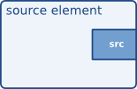
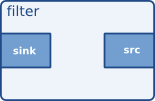
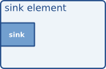

# 2 Different scheduling modes

pad的调度模式定义了如何从(source)pad检索数据或将数据提供给(sink) pad。GStreamer可以在两种调度模式下工作，称为push-mode和pull-mode。GStreamer支持在任何调度模式下具有pad的元素，其中并非所有pad都需要运行在同一模式下。

到目前为止，我们只讨论了_chain()操作元素，即在其sink pad上设置了chain函数并在其source pad上设置了push buffer的元素。我们称其为push-mode，因为节点元素将在srcpad上使用gst_pad_push()，这将导致调用_chain()函数，这将导致我们的元素在source pad上推出一个缓冲区。当它推出一个缓冲区时，启动数据流的行动发生在上游的某个地方，而当它们的_chain()-函数被依次调用时，所有下游元素都被调度。

在我们解释pull-mode调度之前，让我们首先了解如何在pad上选择和激活不同的调度模式。

```c
/* push-mode  */

gst_pad_set_chain_function (filter->sinkpad,
      GST_DEBUG_FUNCPTR (gst_my_filter_chain));

...

static GstFlowReturn
gst_my_filter_chain (GstPad * pad, GstObject * parent, GstBuffer * buf)
{
  GstMyFilter *filter;

  filter = GST_MYFILTER (parent);

  if (filter->silent == FALSE)
    g_print ("I'm plugged, therefore I'm in.\n");

  /* just push out the incoming buffer without touching it */
  return gst_pad_push (filter->srcpad, buf);
}
```





## The pad activation stage

在READY->PAUSED的元素状态变化期间，元素的pad将被激活。这首先发生在source pad上，然后发生在元素的sink pad上。GStreamer调用pad的_activate()。默认情况下，该函数将通过调用gst_pad_activate_mode()以GST_PAD_MODE_PUSH调度模式激活pad以push模式。可以覆盖pad的_activate()，并决定使用不同的调度模式。通过覆盖_activate_mode()函数，你可以知道pad是在什么调度模式下激活的。

GStreamer允许元素的不同pad以不同的调度模式运行。这允许许多不同的可能用例。下面是一些典型用例的概述。

 - 如果一个元素的所有pads在push-mode调度中被激活，那么该元素作为一个整体在push-mode下工作。对于source elements，这意味着它们必须启动一个任务，将source pad上的缓冲区推到下游元素。下游元素将使用sink pads _chain()函数将数据推送给source pads。<span style="background-color: pink;">这种调度模式的先决条件是，使用gst_pad_set_chain_function()为每个sink pad设置了一个链函数，所有下游元素都以相同的模式运行。</span>

 - 或者，sink pad可以通过pull-mode操作成为管道背后的驱动力，而元素的source pad仍然以push-mode操作。为了成为驱动力，这些pad在被激活时启动GstTask。这个任务是一个线程，它将调用元素指定的函数。在调用时，该函数将对所有sinkpad进行随机数据访问(通过gst_pad_pull_range())，并可以在sourcepad上推送数据，这实际上意味着该元素控制管道中的数据流。这种模式的先决条件是，所有下游元素都可以在push模式下工作，而所有上游元素都可以在pull模式下工作(见下文)。

    当source pad从GST_QUERY_SCHEDULING查询返回GST_PAD_MODE_PULL时，可以通过下游成员以pull-mode激活source pad。这种调度模式的先决条件是，使用gst_pad_set_getrange_function()为源pad设置了一个getrange-function。

 - 最后，元素中的所有pad都可以在pull-mode下激活。但与上述相反，这并不意味着它们自己启动一个任务。相反，这意味着它们是下游元素的pull slave，并且必须通过它们的_get_range()函数提供对它的随机数据访问。要求是使用函数gst_pad_set_getrange_function()在这个pad上设置_get_range()函数。此外，如果元素有任何sinkpad，那么所有这些pad(以及它们的同类)也需要在PULL访问模式下操作。

当一个sink元素在拉模式下被激活时，它应该启动一个在其sinkpad上调用gst_pad_pull_range()的任务。只有当上游调度查询返回支持GST_PAD_MODE_PULL调度模式时，它才能这样做。

在接下来的两个部分中，我们将更深入地讨论拉模式调度(elements/pads driving the pipeline, and elements/pads providing random access)，并给出一些特定的用例。

## Pads driving the pipeline

sinkpad以pull模式工作，而sourcepad以push模式工作(或者当它是sink时没有sourcepad)，可以启动一个任务来驱动管道数据流。在这个task函数中，用户可以随机访问所有sinkpad，并通过sourcepad推送数据。这对于几种不同类型的元素都很有用:

 - demuxers、parsers和某些类型的解码器(如mpeg音频或视频流)，因为它们更喜欢从输入中精确(随机)访问数据。但是，如果可能的话，这些元件也应该准备以推模式运行。

 - 某些类型的音频输出，需要控制其输入数据流，例如Jack sound服务器。

首先，你需要执行一个调度查询来检查上游元素是否支持拉取模式调度。如果可能的话，你可以在pull模式下激活sinkpad。然后在activate_mode函数中启动该任务。

```c
#include "filter.h"
#include <string.h>

static gboolean gst_my_filter_activate      (GstPad      * pad,
                                             GstObject   * parent);
static gboolean gst_my_filter_activate_mode (GstPad      * pad,
                                             GstObject   * parent,
                                             GstPadMode    mode,
                         gboolean      active);
static void gst_my_filter_loop      (GstMyFilter * filter);

G_DEFINE_TYPE (GstMyFilter, gst_my_filter, GST_TYPE_ELEMENT);
GST_ELEMENT_REGISTER_DEFINE(my_filter, "my-filter", GST_RANK_NONE, GST_TYPE_MY_FILTER);

static void
gst_my_filter_init (GstMyFilter * filter)
{

[..]

  gst_pad_set_activate_function (filter->sinkpad, gst_my_filter_activate);
  gst_pad_set_activatemode_function (filter->sinkpad,
      gst_my_filter_activate_mode);


[..]
}

[..]

static gboolean
gst_my_filter_activate (GstPad * pad, GstObject * parent)
{
  GstQuery *query;
  gboolean pull_mode;

  /* first check what upstream scheduling is supported */
  query = gst_query_new_scheduling ();

  if (!gst_pad_peer_query (pad, query)) {
    gst_query_unref (query);
    goto activate_push;
  }

  /* see if pull-mode is supported */
  pull_mode = gst_query_has_scheduling_mode_with_flags (query,
      GST_PAD_MODE_PULL, GST_SCHEDULING_FLAG_SEEKABLE);
  gst_query_unref (query);

  if (!pull_mode)
    goto activate_push;

  /* now we can activate in pull-mode. GStreamer will also
   * activate the upstream peer in pull-mode */
  return gst_pad_activate_mode (pad, GST_PAD_MODE_PULL, TRUE);

activate_push:
  {
    /* something not right, we fallback to push-mode */
    return gst_pad_activate_mode (pad, GST_PAD_MODE_PUSH, TRUE);
  }
}

static gboolean
gst_my_filter_activate_pull (GstPad    * pad,
                 GstObject * parent,
                 GstPadMode  mode,
                 gboolean    active)
{
  gboolean res;
  GstMyFilter *filter = GST_MY_FILTER (parent);

  switch (mode) {
    case GST_PAD_MODE_PUSH:
      res = TRUE;
      break;
    case GST_PAD_MODE_PULL:
      if (active) {
        filter->offset = 0;
        res = gst_pad_start_task (pad,
            (GstTaskFunction) gst_my_filter_loop, filter, NULL);
      } else {
        res = gst_pad_stop_task (pad);
      }
      break;
    default:
      /* unknown scheduling mode */
      res = FALSE;
      break;
  }
  return res;
}


```

一旦启动，任务就可以完全控制输入和输出。任务函数最简单的情况是读取输入并将其推送到source pad。它不是那么有用，但比我们目前为止看到的旧的推模式情况提供了更多的灵活性。

```c
    #define BLOCKSIZE 2048

    static void
    gst_my_filter_loop (GstMyFilter * filter)
    {
      GstFlowReturn ret;
      guint64 len;
      GstBuffer *buf = NULL;

      if (!gst_pad_query_duration (filter->sinkpad, GST_FORMAT_BYTES, &len)) {
        GST_DEBUG_OBJECT (filter, "failed to query duration, pausing");
        goto stop;
      }

       if (filter->offset >= len) {
        GST_DEBUG_OBJECT (filter, "at end of input, sending EOS, pausing");
        gst_pad_push_event (filter->srcpad, gst_event_new_eos ());
        goto stop;
      }

      /* now, read BLOCKSIZE bytes from byte offset filter->offset */
      ret = gst_pad_pull_range (filter->sinkpad, filter->offset,
          BLOCKSIZE, &buf);

      if (ret != GST_FLOW_OK) {
        GST_DEBUG_OBJECT (filter, "pull_range failed: %s", gst_flow_get_name (ret));
        goto stop;
      }

      /* now push buffer downstream */
      ret = gst_pad_push (filter->srcpad, buf);

      buf = NULL; /* gst_pad_push() took ownership of buffer */

      if (ret != GST_FLOW_OK) {
        GST_DEBUG_OBJECT (filter, "pad_push failed: %s", gst_flow_get_name (ret));
        goto stop;
      }

      /* everything is fine, increase offset and wait for us to be called again */
      filter->offset += BLOCKSIZE;
      return;

    stop:
      GST_DEBUG_OBJECT (filter, "pausing task");
      gst_pad_pause_task (filter->sinkpad);
    }

```

## Providing random access

在上一节中，我们讨论了激活元素(或pad)以使用它们自己的任务驱动管道时，必须在它们的sinpad上使用拉模式调度。这意味着所有连接到这些Pad的Pad都需要在拉模式下激活。以pull模式激活的src pad必须使用gst_pad_set_getrange_function()实现一个_get_range()函数集，当对端pad使用gst_pad_pull_range()请求一些数据时，将调用该函数。元素负责寻找正确的偏移量，并提供所请求的数据。有几个元素可以实现随机访问:

 - 数据源，如文件源，可以以合理的低延迟提供任何偏移量的数据。
 - 希望在整个管道上提供拉模式调度的过滤器。

 - 解析器可以通过跳过输入的一小部分来轻松提供这一点，因此本质上是“转发”getrange请求，而不涉及任何自己的处理。例如标签阅读器(如ID3)或单输出解析器，如WAVE解析器。

下面的例子展示了如何在源元素中实现_get_range()函数:
 
```c
#include "filter.h"
static GstFlowReturn
        gst_my_filter_get_range (GstPad     * pad,
                     GstObject  * parent,
                     guint64      offset,
                     guint        length,
                     GstBuffer ** buf);

G_DEFINE_TYPE (GstMyFilter, gst_my_filter, GST_TYPE_ELEMENT);
GST_ELEMENT_REGISTER_DEFINE(my_filter, "my-filter", GST_RANK_NONE, GST_TYPE_MY_FILTER);


static void
gst_my_filter_init (GstMyFilter * filter)
{

[..]

  gst_pad_set_getrange_function (filter->srcpad,
      gst_my_filter_get_range);

[..]
}

static GstFlowReturn
gst_my_filter_get_range (GstPad     * pad,
             GstObject  * parent,
             guint64      offset,
             guint        length,
             GstBuffer ** buf)
{

  GstMyFilter *filter = GST_MY_FILTER (parent);

  [.. here, you would fill *buf ..]

  return GST_FLOW_OK;
}

```
在实践中，许多理论上可以进行随机访问的元素，在实践中通常可能在push模式调度中被激活，因为没有下游元素能够启动自己的任务。因此，在实践中，这些元素应该实现一个_get_range()函数和一个_chain()函数(用于filters和parsers)，或者一个_get_range()函数，并准备通过提供_activate_*()函数(用于源元素)来启动它们自己的任务。
