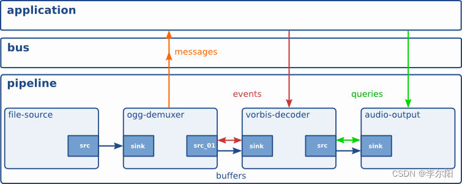
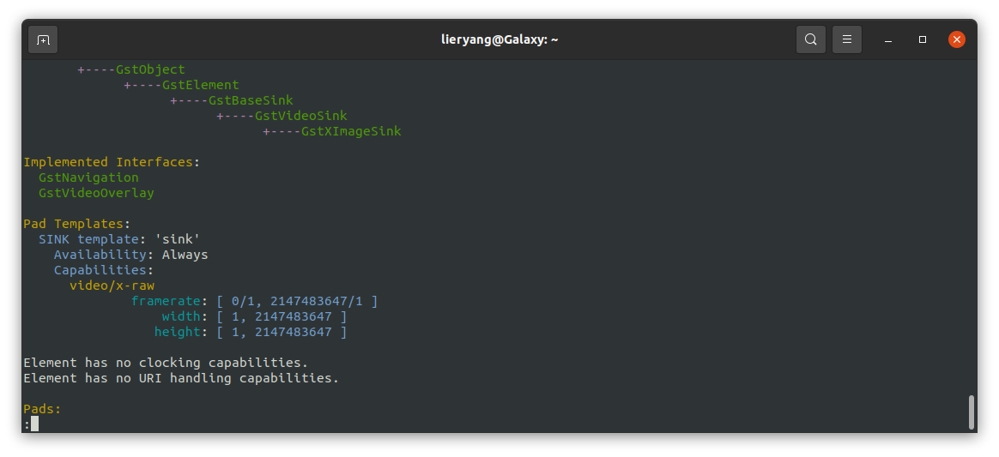

# Pad总结
这一节文档是基于Gstreamer基础课程、应用开发、插件开发等基础知识的总结。

Pad是元素的输入和输出，可以连接元素。具备传输events、buffers、queries功能。



## 1 Pad基础知识

### 1.1 GstPad对象继承关系

```sh
# GstPad对象继承关系
GObject
    ╰──GInitiallyUnowned
        ╰──GstObject
            ╰──GstPad
```

### 1.2 使用gst-inspect-1.0命令查看element的Pad信息


- **Pad名称**：SRC template或者SINK template后面的就是Pad的名称，由于某些Pad可能有多个Video输出或输入，所有名称`video_%u`。

- **Pad方向**：Src或者Sink

- **Pad可获得性**：Availability有三种，分别是Always，Sometimes，Request。

- **Pad功能**：Capabilities支持处理的数据类型，比如 video/mj2、ANY。


## 2 Pad定义

以ximagesink为例：



```c

/* 定义静态Pad模板 */
static GstStaticPadTemplate gst_x_image_sink_sink_template_factory =
GST_STATIC_PAD_TEMPLATE ("sink",
    GST_PAD_SINK,
    GST_PAD_ALWAYS,
    GST_STATIC_CAPS ("video/x-raw, "
        "framerate = (fraction) [ 0, MAX ], "
        "width = (int) [ 1, MAX ], " "height = (int) [ 1, MAX ]")
    );

static void
gst_x_image_sink_class_init (GstXImageSinkClass * klass) {

  ...

  GstElementClass *gstelement_class;
  gstelement_class = (GstElementClass *) klass;

  ...

  /* 绑定pad模板到类 */
  gst_element_class_add_static_pad_template (gstelement_class,
      &gst_x_image_sink_sink_template_factory);
}

```

[更多信息，可以参考插件开发中的 Request and Sometimes pads](./04_AdvancedConcepts/01_Request_and_Sometimes_pads.md)


## 3 GstPad连接

#### GstCaps

为什么先讲GstCaps呢？因为Pad功能信息由GstCaps存储，如果想要指定Caps连接，肯定绕不过GstCaps。

```sh
# 继承关系
GstMiniObject
    ╰──GstCaps
```

#### GstStructure

GstCaps当中存储的信息，可以通过GstStructure读取，GstStructure是一个键/值对的集合。键使用 GQuarks 表示，而值可以是任何 GType 类型。

除了键/值对之外，GstStructure 还有一个名称。名称以字母开头，可以由字母、数字和以下任何字符填充："/-_.:"。

GstStructure 被各种 GStreamer 子系统用于以一种灵活和可扩展的方式存储信息。GstStructure 没有引用计数，因为它通常是更高级别对象的一部分，比如 GstCaps、GstMessage、GstEvent、GstQuery。它提供了一种通过父对象的引用计数来实施可变性的方法，使用 gst_structure_set_parent_refcount 方法。


[基础课程6：媒体格式和Pad功能](https://blog.csdn.net/Creationyang/article/details/128798484?ops_request_misc=%257B%2522request%255Fid%2522%253A%2522169821501016800185897000%2522%252C%2522scm%2522%253A%252220140713.130102334.pc%255Fblog.%2522%257D&request_id=169821501016800185897000&biz_id=0&utm_medium=distribute.pc_search_result.none-task-blog-2~blog~first_rank_ecpm_v1~rank_v31_ecpm-1-128798484-null-null.nonecase&utm_term=Pad&spm=1018.2226.3001.4450)讲述了如何通过GstStructure打印Caps信息。

[三、GstPad与GstCap](https://blog.csdn.net/Creationyang/article/details/120473892?ops_request_misc=%257B%2522request%255Fid%2522%253A%2522169821501016800185897000%2522%252C%2522scm%2522%253A%252220140713.130102334.pc%255Fblog.%2522%257D&request_id=169821501016800185897000&biz_id=0&utm_medium=distribute.pc_search_result.none-task-blog-2~blog~first_rank_ecpm_v1~rank_v31_ecpm-3-120473892-null-null.nonecase&utm_term=Pad&spm=1018.2226.3001.4450)讲述了Pad获取和连接的所有方式。


## 4 Pad之间信息传递
具备传输events、buffers、queries功能。

上面已经说了，element间的数据的传输都是通过pad的，那么，究竟是如何进行数据传递的呢，下面我们来看看。

pad具有两种模式，分别是PUSH和PULL。PUSH模式，就是由上游element控制传输数据的大小与速度，将数据推送到下游element，所以下游的element一般都会设置一个缓冲区来接收数据，PUSH模式一般是通过`gst_pad_push (GstPad * pad, GstBuffer * buffer)`函数完成数据传递的操作；而PULL模式呢，它就是由下游的element告诉上游element需要的数据量，PULL模式通过`gst_pad_pull_range (GstPad * pad, guint64 offset, guint size, GstBuffer ** buffer)`函数完成数据的获取。但是实际究竟是如何完成的呢，继续看代码。

### 4.1 push mode

### 4.2 pull mode

### 4.3 参考

[参考1 官网：Different scheduling modes](https://gstreamer.freedesktop.org/documentation/plugin-development/advanced/scheduling.html?gi-language=c)

[参考2 gstreamer学习笔记---pad定义、连接、流动](https://blog.csdn.net/weixin_41944449/article/details/81568845)

[参考3 Gstreamer调度模式的分析](http://www.rosoo.net/a/201007/9825.html)

## 参考

[参考1：gstreamer学习笔记---pad定义、连接、流动](https://blog.csdn.net/weixin_41944449/article/details/81568845)
